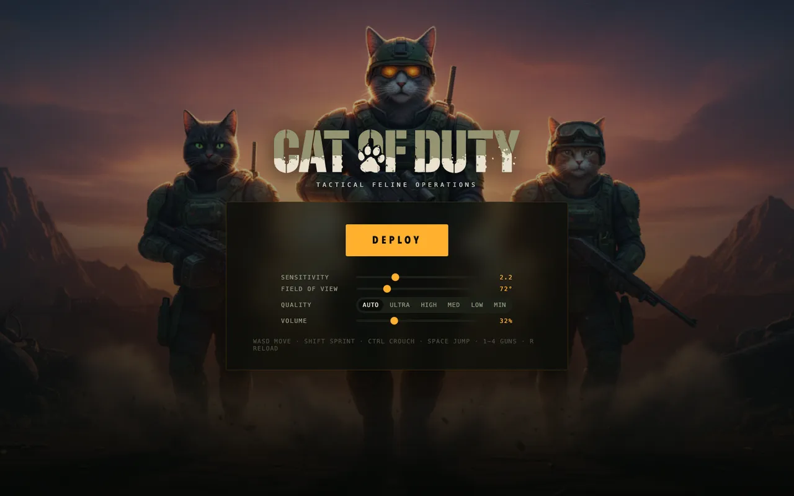
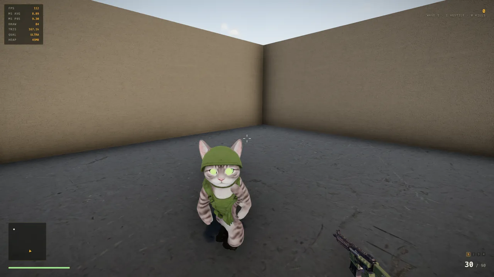
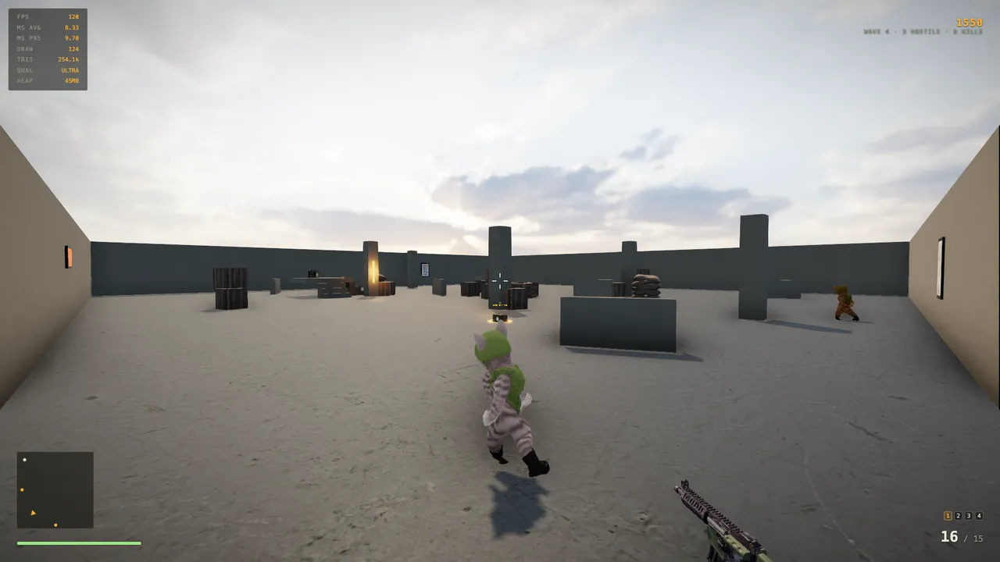

# Cat of Duty

A browser FPS where a cat soldier fights waves of enemy cats. No install, no
account, no loading bar worth complaining about — open the link, click DEPLOY,
and you are shooting within a few seconds.

### ▶ [Play it here](https://cat-of-duty.vercel.app)



> **A weekend hobby project, non-commercial.** Built for fun and for learning,
> not sold, not monetised, and not accepting money in any form.
>
> **Please keep it that way.** Play it, read it, fork it, learn from it, break
> it, rebuild it — all welcome. Selling it, shipping it in a paid product, or
> otherwise using it commercially is not. That is not just a request: the code
> is under the [PolyForm Noncommercial License](./LICENSE), and the generated
> art and audio are rights-reserved on top of that.
>
> **An unofficial parody.** Not affiliated with, endorsed by, sponsored by, or
> connected to Activision or the Call of Duty franchise. No assets, audio, HUD
> layouts, fonts, or text were copied from Call of Duty or any other commercial
> game — everything here is original or CC0. See [`CREDITS.md`](./CREDITS.md).

---

## What's in it

- **Four weapons** — PAWS-15 rifle, SCRATCH-12 shotgun, LONGWHISKER sniper,
  PURR-90 SMG. Per-gun recoil patterns, ADS, spread, falloff, and reload.
- **Three enemy archetypes** — rushers that close on you, gunners that hold
  range and telegraph a visible windup before firing dodgeable projectiles,
  and heavies that soak damage. Every fifth wave is a heavy drop.
- **Wave loop with a breather** — clear the field, get seven seconds to shop.
- **A field-promotion economy** — kills earn TUNA; spend it between waves on
  damage, ammo capacity, or max health.
- **Feel work** — hit-confirm audio tiers, kill-streak callouts, footsteps,
  viewmodel sway, sprint FOV kick, muzzle-flash falloff, and a longer hit-stop
  on headshot kills.



## Controls

| Input | Action |
| --- | --- |
| `W` `A` `S` `D` | Move |
| `Shift` | Sprint (forward only) |
| `Ctrl` or `C` | Crouch |
| `Space` | Jump |
| Mouse / `LMB` | Look / fire |
| `RMB` | Aim down sights |
| `1` – `4` | Switch weapon (must own it) |
| `R` | Reload (empty mags also auto-reload) |
| `Z` `X` `V` | Buy upgrades — during the between-wave intermission only |
| `Q` | Cycle quality tier |
| `F1` / `F3` | Tuning panel / performance overlay |

## Running it locally

```bash
npm install
npm run dev        # http://127.0.0.1:5177
```

```bash
npm run build      # typecheck + production build
npm run typecheck  # tsc over src and scripts
npm run loop       # 14-step Playwright gameplay harness (needs the dev server up)
npm run perf       # frame-time / draw-call measurement
```

The Playwright harnesses drive a real browser and assert against live game
state. They expect the dev server on port `5177`, which `npm run dev` pins.

## Tech

Vite · TypeScript (strict) · Three.js · Rapier physics · Howler ·
postprocessing + N8AO. The HUD is DOM and CSS rather than canvas, so it stays
crisp and costs nothing on the render thread.

Total asset payload is about 15 MB. It started at 140 MB — the animation files
each carried a duplicate copy of the character mesh, which is what a clip
export gives you if nobody looks. Stripping those and running everything
through meshopt with WebP textures did the rest.



## How it was built

Almost entirely by AI agents — Claude Code — working in waves, with a human
directing and playtesting. [`PROGRESS.md`](./PROGRESS.md) is the full log, wave
by wave, including the things that broke.

Each wave ran the same shape:

1. **Scout** the subsystems and report exact insertion points.
2. **Build** in parallel, each agent restricted to files no sibling touches.
3. **Gate** — TypeScript on two configs, production build, and the 14-step
   gameplay harness twice, with zero console errors required.
4. **QA adversarially** — a separate agent gets the original complaint and the
   running game, never the builders' claims, and judges from screenshots and
   game state it collects itself.
5. **Ship** only if every gate is green.

That QA split earned its keep. It is the step that caught a purchase key
double-bound to crouch, a health bar that read full between 100 and 125 HP, and
an upgrade chip that kept stale state after a restart.

The most interesting bug of the project came from the arena being made bigger:
cats began wedging permanently against cover. The first fix was a guess and was
wrong. Instrumenting the actual per-tick motion showed three distinct failure
geometries — a flat face, a pocket between crates where opposing push normals
cancelled, and a tick-perfect limit cycle on a pillar corner where the escape
nudge was fighting the natural slide. The real fix was wall-slide steering plus
a net-progress watchdog, because a cat can move constantly and still go
nowhere.

## Repository layout

```
src/
  core/      loop, state, events, input, asset loading
  player/    controller, camera feel, health
  weapons/   weapon system, viewmodel, configs, effects
  enemies/   AI, visuals, projectiles, overlays
  gameplay/  pickups, weapon pickups, upgrades
  levels/    arena geometry
  render/    renderer, post-processing, quality tiers
  ui/        HUD and menu (DOM + CSS)
  audio/     synth cues and recorded samples
scripts/     Playwright harnesses (gameplay, perf, latency, capture)
public/      textures, HDRI, generated models, audio, art
```

## License

**Code: [PolyForm Noncommercial 1.0.0](./LICENSE).** Use it, study it, modify
it, share it, build on it — for any noncommercial purpose. The license text
calls out hobby projects, personal study, and private entertainment explicitly,
which is the spirit here. Commercial use of any kind is not granted.

*A note on wording:* because it restricts commercial use, this is **source
available** rather than "open source" in the strict [OSI](https://opensource.org/osd)
sense — that definition does not allow licenses to exclude a field of use.
Everything is public and readable; only selling it is off the table.

**Assets are separate and more restrictive.** The Poly Haven textures and HDRI
are CC0 and free to reuse. The generated models, audio, and art are
rights-reserved and ship only so the game runs when you clone it. Full
reasoning and per-file provenance: [`LICENSE-ASSETS.md`](./LICENSE-ASSETS.md)
and [`CREDITS.md`](./CREDITS.md). If you fork this, bring your own art.
